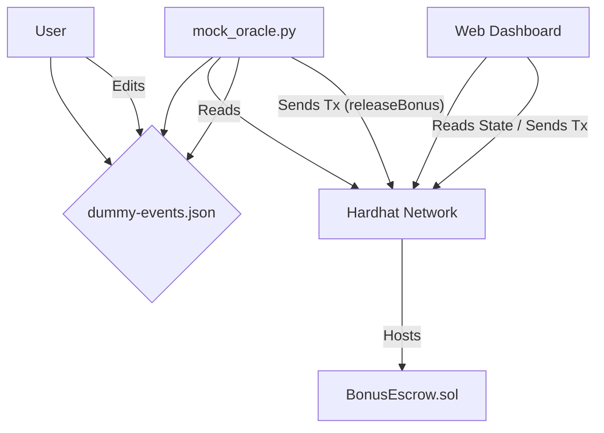

# Trust-Chain Bonus: Local Simulation Architecture

This document outlines the architectural overview of the Trust-Chain Bonus local simulation project, detailing its core components, primary simulation workflow, and key data structures.

## 1. Core Components

The project is composed of several interconnected components designed to simulate a bonus distribution system on a local blockchain environment:

*   **Web Dashboard (Frontend):** A simple web interface built with Next.js and Ethers.js. Its primary function is to interact with the smart contracts deployed on the local Hardhat Network, allowing users to monitor the state of the smart contracts (e.g., escrow balance) and potentially trigger transactions.
*   **Smart Contracts (BonusEscrow.sol):** The core business logic of the bonus system, written in Solidity. These contracts are deployed on the local Hardhat Network and manage the locking and payment of bonuses. The main contract is `BonusEscrow.sol`.
*   **Hardhat Network (Local Blockchain):** A local Ethereum development environment that serves as the blockchain for the simulation. It provides a controlled and isolated environment for deploying and interacting with smart contracts without real-world implications or costs.
*   **Python Mock Oracle Script (`mock_oracle.py`):** A Python 3 script that acts as a "mock oracle." It reads event data from `dummy-events.json` and, based on predefined conditions (e.g., "target tercapai" event), triggers functions (specifically `releaseBonus()`) on the deployed smart contracts via `web3.py`.
*   **`dummy-events.json` (Data Source):** A JSON file that serves as the source of simulated external events. This file allows users to manually input data that mimics real-world performance triggers (e.g., API completion, task completion) without requiring integration with external services like GitHub or Trello.

## 2. Primary Simulation Workflow

The core simulation process follows a step-by-step flow, demonstrating the interaction between the various components:

1.  **Local Blockchain Setup:** The architect (user) initiates the local blockchain node by running Hardhat.
2.  **Smart Contract Deployment:** The `BonusEscrow.sol` smart contract is deployed to the running local Hardhat Network.
3.  **Event Data Preparation:** The user edits the `dummy-events.json` file to introduce new events. For example, an entry like `{ "event": "API_COMPLETED", "developer_wallet": "0x...", "bonus": 1.0 }` might be added to simulate a completed task.
4.  **Mock Oracle Execution:** The user executes the Python script `mock_oracle.py`.
5.  **Event Processing and Transaction Trigger:** The `mock_oracle.py` script reads the newly added events from `dummy-events.json`. If an event signifies a "target tercapai" (target achieved), the script connects to the local Hardhat node and calls the `releaseBonus()` function on the deployed `BonusEscrow.sol` smart contract.
6.  **State Verification:** The user verifies the state of the smart contract (either through the Web Dashboard or via another script) to confirm that the bonus has been "sent" or processed as expected.

## 3. Architectural Diagram



## 4. Key Data Structure Definition: `dummy-events.json`

The `dummy-events.json` file is a crucial component for simulating external events that trigger bonus payments. It is a JSON array of objects, where each object represents a single event.

**Purpose:** To provide a configurable and easily editable source of mock event data, allowing developers to test the smart contract logic and the mock oracle script without relying on live external integrations.

**Structure:** Each event object within the JSON array is expected to have the following structure:

```json
[
  {
    "event": "EVENT_TYPE",
    "developer_wallet": "0x...",
    "bonus": 0.0
  },
  {
    "event": "ANOTHER_EVENT_TYPE",
    "developer_wallet": "0x...",
    "bonus": 0.0
  }
]
```

*   **`event` (string):** A string representing the type of event that occurred (e.g., `"API_COMPLETED"`, `"TASK_FINISHED"`). The `mock_oracle.py` script will interpret this field to determine if a bonus should be triggered.
*   **`developer_wallet` (string):** The Ethereum wallet address (e.g., `"0x..."`) of the developer or recipient associated with the event. This address will be used by the smart contract for bonus distribution.
*   **`bonus` (number):** The amount of bonus (e.g., `1.0`, `0.5`) to be processed for this event. This value will be passed to the smart contract's `releaseBonus()` function.