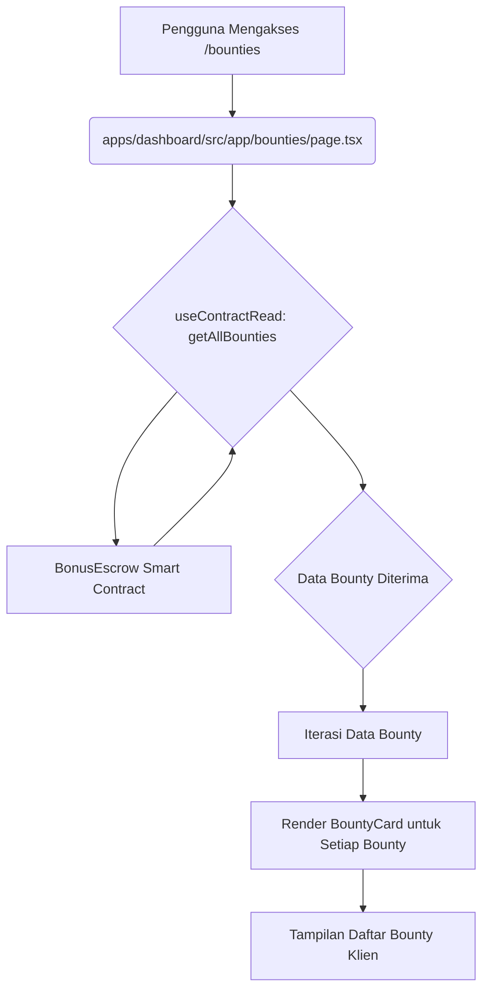

# Rencana Pengembangan Halaman Bounty Klien

Dokumen ini menguraikan rencana untuk mengembangkan halaman web baru yang berorientasi klien untuk menampilkan daftar 'bounty'. Halaman ini akan mereplikasi struktur, tata letak, dan elemen data utama dari halaman admin yang ada, namun disesuaikan untuk akses publik. Setiap 'bounty' baru yang diunggah melalui panel admin harus segera muncul dan dapat diakses di halaman klien ini.

## Tujuan

*   Mengembangkan halaman web yang berorientasi klien untuk menampilkan daftar bounty.
*   Memastikan pembaruan real-time untuk bounty baru yang diunggah melalui panel admin.
*   Menyediakan tampilan hanya-baca dari bounty tanpa fungsionalitas admin.
*   Mengintegrasikan halaman baru ke dalam navigasi aplikasi yang ada.

## Rencana Langkah demi Langkah

1.  **Buat Halaman Daftar Bounty Klien Baru**:
    *   Buat file halaman baru, `apps/dashboard/src/app/bounties/page.tsx`, yang akan berfungsi sebagai halaman daftar bounty yang berorientasi klien.
    *   Halaman ini akan bertanggung jawab untuk mengambil semua bounty dari kontrak pintar `BonusEscrow` menggunakan fungsi `getAllBounties`.

2.  **Tampilkan Daftar Bounty Menggunakan `BountyCard`**:
    *   Iterasi melalui data bounty yang diambil dari `getAllBounties` dan render komponen `BountyCard` untuk setiap bounty.
    *   Pastikan `BountyCard` menampilkan informasi yang relevan untuk tampilan publik (judul, deskripsi, hadiah, status).
    *   Sesuaikan tautan "View Details" di `BountyCard` agar mengarah ke halaman detail bounty yang ada (`/bounty/[id]`).

3.  **Pastikan Pembaruan Real-time**:
    *   `useContractRead` dari `wagmi` akan digunakan untuk memuat data bounty, yang secara otomatis menangani caching dan re-fetching, memastikan bounty baru segera muncul.

4.  **Penyesuaian UI/UX untuk Akses Publik**:
    *   Halaman klien tidak akan memiliki fungsionalitas admin (misalnya, "Accept Bounty", "Complete Bounty", "Pay Bounty"). Ini akan menjadi tampilan hanya-baca dari bounty.
    *   Tata letak dan gaya akan konsisten dengan aplikasi dashboard yang ada, tetapi disederhanakan untuk pengguna publik.

5.  **Integrasi Navigasi**:
    *   Tambahkan tautan ke halaman bounty klien baru di navigasi utama aplikasi dashboard. Ini akan dilakukan dengan membuat komponen `Navbar` baru di `apps/dashboard/src/components/Navbar.tsx` dan mengintegrasikannya ke dalam `apps/dashboard/src/app/layout.tsx`.

## Diagram Alur Data



## Struktur Komponen

```mermaid
graph TD
    A[apps/dashboard/src/app/bounties/page.tsx] --> B[BountyCard.tsx]
    C[apps/dashboard/src/app/layout.tsx] --> D[Navbar.tsx]
    D --> A